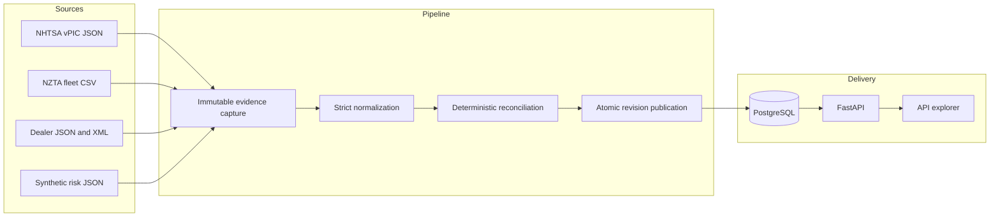

# NZ Vehicle Data Pipeline

**A deterministic data integration service that turns conflicting vehicle evidence into canonical, auditable records.**

Vehicle data rarely arrives as one clean record. Manufacturer specifications, dealer listings, fleet extracts, and risk checks use different formats and can disagree about the same vehicle.

This service preserves each source record, normalizes it, applies field-specific resolution rules, and publishes a versioned canonical view through FastAPI. Every resolved value remains linked to its evidence.

> [!IMPORTANT]
> This is an offline data integration reference implementation, not a live New Zealand vehicle lookup service. PPSR, stolen, write-off, and dealer records are synthetic.
>
> It must not be used for purchase, ownership, finance, insurance, or safety decisions.

## Explore the system

Start the API and load the versioned fixture set:

```bash
docker compose up -d --build api
docker compose --profile tools run --rm seed
# Visit http://localhost:8000/docs
```

The custom documentation page provides scenario shortcuts, endpoint search, live requests, confidence guidance, and links to the OpenAPI contract.

| Resource | Local URL |
|---|---|
| Interactive API documentation | [http://localhost:8000/docs](http://localhost:8000/docs) |
| OpenAPI 3 contract | [http://localhost:8000/openapi.json](http://localhost:8000/openapi.json) |
| Health check | [http://localhost:8000/health](http://localhost:8000/health) |
| Database readiness | [http://localhost:8000/ready](http://localhost:8000/ready) |

The seeded release contains:

| Evidence and output | Count |
|---|---:|
| Immutable source observations | 23 |
| Eligible normalized records | 20 |
| Evidence-only records | 2 |
| Rejected malformed records | 1 |
| Canonical vehicles | 5 |
| Canonical revisions | 6 |

## What the pipeline does

1. Captures source payloads as immutable observations with hashes and retrieval times.
2. Parses strict JSON, XML, and CSV contracts at the trust boundary.
3. Normalizes source-specific fields and validates full 17-character VINs.
4. Extracts candidate values with field-level provenance.
5. Resolves each field with versioned authority, agreement, freshness, and validation rules.
6. Records disagreements instead of silently choosing a convenient value.
7. Publishes a new canonical revision only when the material result changes.
8. Exposes current records, revision history, conflicts, provenance, and raw evidence through a read-only API.

## Scenario guide

The fixture manifest includes five canonical vehicles. Each one exercises a distinct reconciliation path.

| Scenario | VIN | Expected result |
|---|---|---|
| Clean | `1HGCR2F85HA000000` | Agreed specifications and synthetic negative risk signals, with `MEDIUM` confidence |
| Risky | `1FA6P8CF8H5000000` | Synthetic PPSR match, stolen listing, and statutory write-off |
| Unknown | `JM0BL10F000000000` | Risk fields remain `UNKNOWN`; missing evidence is not inferred as clean |
| Conflict | `WAUZZZ8K7BA000000` | Equal-authority PPSR values remain unresolved, with `LOW` confidence |
| Format parity | `KMHD35LH2JU000000` | JSON and XML dealer feeds produce the same normalized facts while preserving separate observations |
| Multi-revision | `1HGCR2F85HA000000` | Phase 2 dealer update publishes Revision 2 (price drops to $19,950, mileage to 52,300 km) |

Retrieve the clean scenario:

```bash
curl -s http://localhost:8000/v1/vehicles/1HGCR2F85HA000000
```

The response includes canonical fields, revision metadata, confidence, conflicts, provenance, and a synthetic-data notice when applicable.

```json
{
  "vin": "1HGCR2F85HA000000",
  "revision_id": "rev_1HGCR2F85HA000000_2",
  "revision_number": 2,
  "canonical_fields": {
    "make": "HONDA",
    "model": "ACCORD",
    "year": 2017,
    "asking_price_cents": 1995000,
    "odometer_km": 52300,
    "ppsr_result": "NO_MATCH",
    "stolen_status": "NOT_LISTED",
    "writeoff_status": "NONE"
  },
  "field_provenance": {
    "make": [
      {
        "source_system": "DEALER_FEED",
        "source_record_id": "LST_HONDA_01",
        "synthetic": true
      },
      {
        "source_system": "NHTSA_VPIC",
        "source_record_id": "1HGCR2F85HA000000",
        "synthetic": false
      }
    ]
  },
  "conflicts": [],
  "confidence": {
    "band": "MEDIUM"
  },
  "synthetic_notice": "This record represents no real vehicle, person, police report, insurance decision, or financial obligation."
}
```

The example is abbreviated. The API returns the complete confidence calculation and provenance links.

Try the unresolved conflict:

```bash
curl -s http://localhost:8000/v1/vehicles/WAUZZZ8K7BA000000/conflicts
```

Inspect an immutable raw observation:

```bash
curl -s \
  http://localhost:8000/v1/observations/obs_dealer_feed_dealer_xml_LST_HYUNDAI_02
```

Raw payloads appear only on the observation endpoint. Vehicle responses do not embed source payloads.

Discover vehicles through the paginated catalog:

```bash
curl -s "http://localhost:8000/v1/vehicles?limit=5&offset=0"
```

Inspect revision progression across time:

```bash
curl -s http://localhost:8000/v1/vehicles/1HGCR2F85HA000000/history
```

## Architecture, provenance, and data flow

Provenance stays attached as data moves from source capture to API delivery.



The code is split into four layers:

| Layer | Responsibility |
|---|---|
| Connectors | Read source-specific JSON, XML, and CSV without leaking source types into the domain |
| Normalization | Validate payloads, map fields, and classify records as eligible, rejected, or evidence-only |
| Reconciliation | Extract candidates, apply deterministic field rules, record conflicts, and calculate confidence |
| Persistence and API | Store immutable evidence, publish canonical revisions atomically, and expose read-only resources |

## Engineering decisions

### Immutable evidence before transformation

Every input is stored with its original payload, source identifier, retrieval time, and SHA-256 fingerprint. Normalization and reconciliation never overwrite that evidence.

### VIN as the canonical identity

A valid 17-character VIN is the only key that can create or join a canonical vehicle. Truncated NZTA `VIN11` values remain evidence-only and cannot define identity.

### Field-specific resolution

There is no global source priority and no latest-write-wins fallback. Each field uses an explicit rule version. Equal-authority disagreement can produce an unresolved field.

### Deterministic confidence

Confidence measures evidence strength, not truth probability. The score combines authority, agreement, freshness, and validation with fixed weights and an explicit evaluation time.

### Material revisions only

Reprocessing identical evidence is a no-op. PostgreSQL row locks and material hashes ensure concurrent publication creates one revision only when the canonical result changes.

### Synthetic origin remains visible

Synthetic provenance is present on field links and conflicts. Any canonical response that depends on synthetic evidence includes the required notice.

## API reference

All application routes are read-only.

| Method | Route | Purpose |
|---|---|---|
| `GET` | `/v1/vehicles` | Paginated catalog discovery of current canonical vehicles (`limit`, `offset`) |
| `GET` | `/v1/vehicles/{vin}` | Current canonical vehicle record |
| `GET` | `/v1/vehicles/{vin}/history` | Canonical revision history |
| `GET` | `/v1/vehicles/{vin}/revisions` | Revision history alias |
| `GET` | `/v1/vehicles/{vin}/revisions/{revision_number}` | One historical revision |
| `GET` | `/v1/vehicles/{vin}/conflicts` | Conflicts on the current revision |
| `GET` | `/v1/vehicles/{vin}/provenance` | Field-level provenance on the current revision |
| `GET` | `/v1/observations/{observation_id}` | Raw immutable source observation |
| `GET` | `/health` | Process liveness |
| `GET` | `/ready` | Database readiness |

The machine-readable contract is available at `/openapi.json`.

## Run locally

### Requirements

- Docker Engine with Docker Compose
- Ports `5432` and `8000` available

### Start and seed

```bash
docker compose up -d --build api
docker compose --profile tools run --rm seed
```

The seed command verifies every fixture hash before database work. It uses fixed capture times and expected outcome counts from `fixtures/manifest.json`.

A second seed run reuses all six revisions:

```bash
docker compose --profile tools run --rm seed
```

### Verify the release flow

```bash
bash scripts/smoke-local.sh
```

The smoke script rebuilds the profiled seed image, resets the local database, runs migrations, seeds twice, and verifies API health plus idempotent publication.

### Stop and remove local data

```bash
docker compose down -v
```

This command deletes the local PostgreSQL volume.

## Quality and verification

Run the complete local gate:

```bash
bash scripts/check.sh
```

The gate runs Ruff linting and formatting checks, strict mypy, 130 pytest tests, an Alembic upgrade and rollback cycle, and a package build.

Coverage includes:

- Immutable observation capture and duplicate protection
- Strict normalization for JSON, XML, and CSV
- VIN validation and evidence-only identity handling
- Deterministic resolution, confidence, and replay
- Concurrent PostgreSQL publication
- FastAPI response and OpenAPI contracts
- Synthetic risk semantics and disclaimer propagation
- Docker, CI, seed, and smoke-script contracts
- Scale and throughput benchmarking

### Local development commands

| Action | Command |
|---|---|
| Install dependencies | `uv sync --all-extras` |
| Run the API | `uv run uvicorn nz_vehicle_data_pipeline.api:app --reload` |
| Run tests | `uv run pytest` |
| Run PostgreSQL integration tests | `bash scripts/test-postgres.sh` |
| Check lint and formatting | `uv run ruff check . && uv run ruff format --check .` |
| Run strict type checking | `uv run mypy src tests` |
| Run scale benchmark | `uv run python -m nz_vehicle_data_pipeline.benchmark --count 100 --seed 42` |
| Build the package | `uv build` |

Local API development also requires `DATABASE_URL` to point to a migrated PostgreSQL database.

### Scale and throughput benchmark

A deterministic in-memory benchmark measures end-to-end ingestion and reconciliation performance without external dependencies:

```bash
# Formatted console metrics
uv run python -m nz_vehicle_data_pipeline.benchmark --count 100 --seed 42

# Structured JSON export
uv run python -m nz_vehicle_data_pipeline.benchmark --count 50 --format json
```

## Data sources and usage boundaries

| Source | Fixture classification | Format | Attribution |
|---|---|---|---|
| NHTSA vPIC | Curated public evidence | JSON | United States Government public domain |
| NZTA Motor Vehicle Register extract | Captured public evidence | CSV | CC BY 4.0, Waka Kotahi NZ Transport Agency |
| Dealer listings | Synthetic | JSON and XML | Synthetic test data |
| PPSR results | Synthetic | JSON | Synthetic test data |
| Stolen-vehicle status | Synthetic | JSON | Synthetic test data |
| Write-off classification | Synthetic | JSON | Synthetic test data |

The mandatory synthetic disclaimer is:

> **"This record represents no real vehicle, person, police report, insurance decision, or financial obligation."**

The service does not call live NZTA, PPSR, Police, insurer, or dealer systems. It does not provide ownership, registration, WoF/CoF, finance-clearance, stolen-vehicle, or purchase-safety checks.

NHTSA vPIC data describes vehicles intended for sale or import in the United States. Coverage for non-US vehicles can be incomplete. The included fixture is versioned for offline, deterministic replay.

## Known limitations

- The NZTA fixture contains truncated identity data. These records remain immutable evidence but cannot create canonical vehicles.
- Rejected and evidence-only outcomes appear in ingestion summaries, but their derived disposition and rejection reason are not separate queryable database records.
- The API has no authentication or rate limiting because it exposes only local fixture data. Add both before serving protected or licensed data.
- Compose uses example PostgreSQL credentials and publishes the database on localhost. Replace these defaults before any shared deployment.
- The release runs locally and in CI. Cloud deployment, infrastructure as code, and live restricted-register integrations are outside the current scope.

## Security boundaries

- XML input is size-bounded, rejects dangerous declarations, and enforces an element allowlist.
- Pydantic models reject unexpected fields at source boundaries.
- Fixture hashes fail closed before ingestion starts.
- Vehicle endpoints never echo raw source payloads.
- PostgreSQL constraints protect VIN identity and observation fingerprints.
- The API returns structured errors without stack traces or credentials.

## Troubleshooting

### The API does not become healthy

```bash
docker compose ps
docker compose logs db migrate api
```

The API starts only after PostgreSQL passes its health check and Alembic completes the migration.

### `/ready` reports a database error

Confirm that `DATABASE_URL` is correct and that the database container is healthy. For the Compose setup, wait a few seconds and retry.

### The seed service is missing or stale

The seed service uses the `tools` profile. Run it with the profile explicitly:

```bash
docker compose --profile tools build seed
docker compose --profile tools run --rm seed
```

### The local database needs a clean reset

```bash
docker compose down -v
docker compose up -d --build api
docker compose --profile tools run --rm seed
```

## Generalization beyond vehicle data

The same evidence-first design applies whenever several sources describe one entity and an audit trail matters.

Examples include company-registry reconciliation, supply-chain traceability, and federated records integration.

The reusable pattern combines immutable evidence, deterministic field resolution, explicit conflicts, and versioned canonical projections.

## Technology

Python 3.12, FastAPI, Pydantic v2, SQLAlchemy 2, Psycopg 3, PostgreSQL 18, Alembic, pytest, Ruff, mypy, uv, Docker Compose, and GitHub Actions.
